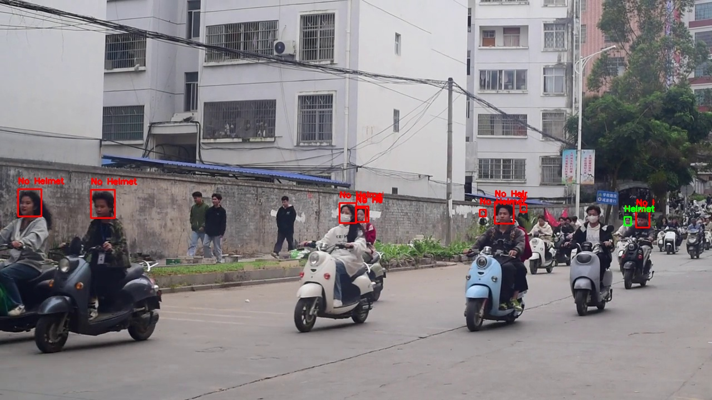

## Project Name: Helmet Compliance Detection System

### Project Overview
This project aims to develop a deep learning model based on YOLOv8 to detect helmet compliance among electric scooter drivers in real-time. The system will monitor video streams in urban traffic settings to automatically identify and flag drivers who are not wearing helmets. By ensuring compliance with safety regulations, this system seeks to enhance road safety and reduce head injuries among scooter riders.

### Objectives
- Implement YOLOv8 for efficient and accurate detection of helmets in various urban environments.
- Integrate the model with existing traffic monitoring systems for seamless operation.
- Improve public safety by encouraging helmet use through automated detection and alerting mechanisms.

### Technology Stack
- **YOLOv8**: Object detection
- **Python**: Backend processing
- **OpenCV**: Video processing
- **pytorch**: Machine learning framework

### Expected Outcomes
The Helmet Compliance Detection System is expected to significantly increase helmet usage among electric scooter drivers, thereby reducing the risk of injuries and enhancing overall road safety.

### Gallery
Below are some visualizations of the system in action:

*Detection of electric scooters in an urban environment.*

*Accurate identification of helmets on scooter drivers.*

*Annotated real-time detection highlighting compliant and non-compliant drivers.*
